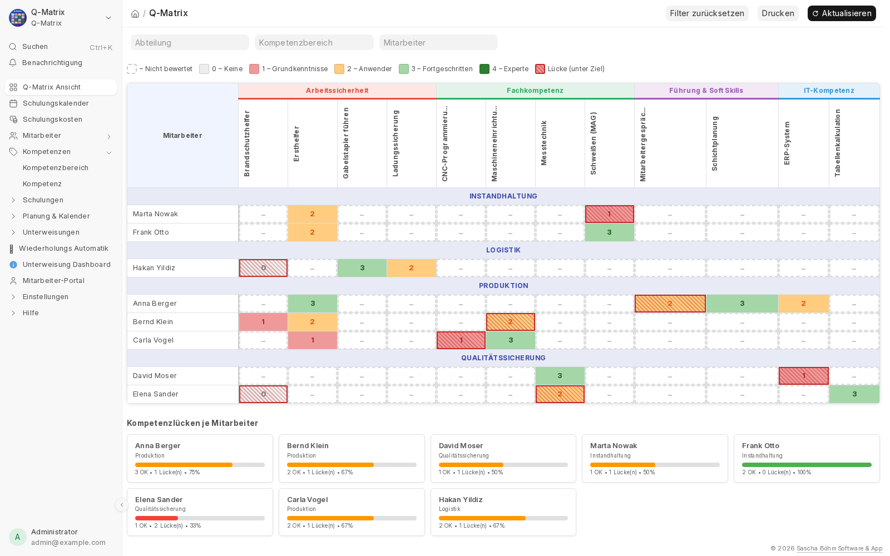
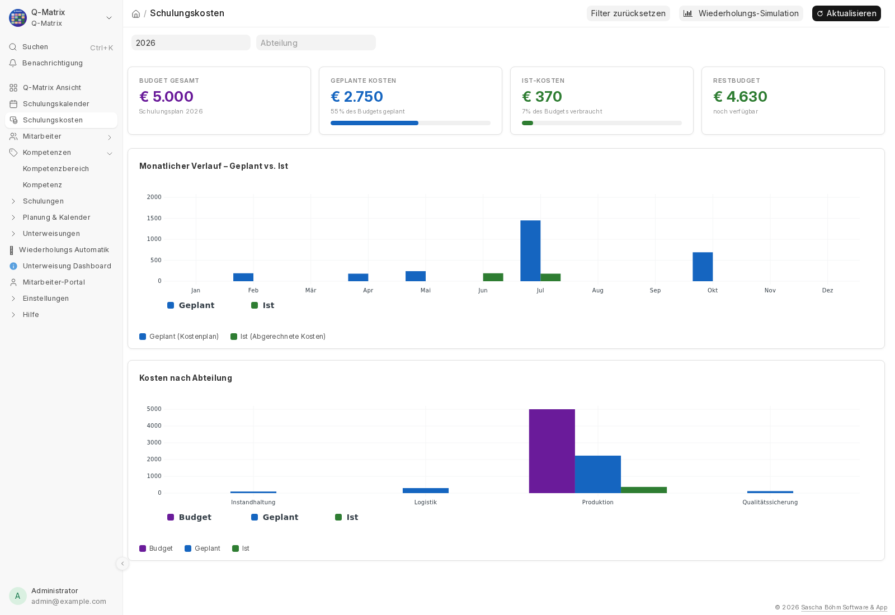
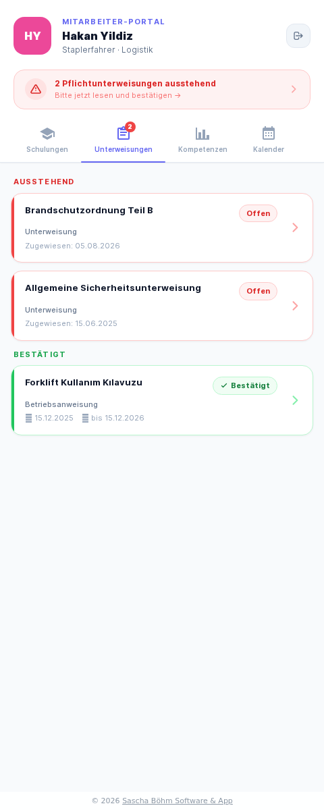

# Q-Matrix — fertig installierbares Paket

**Q-Matrix** ist eine Software für Qualifikationsmatrix, Schulungen und
Unterweisungen. Dieses Paket installiert sie mit **einem einzigen Befehl** auf
Ihrem Rechner oder Server — es muss nichts weiter eingerichtet werden.

Läuft auf **Windows**, **macOS** (auch Apple Silicon) und **Linux**.

---

## Installation in drei Schritten

**1. Docker installieren**

Docker Desktop herunterladen und installieren:
<https://www.docker.com/products/docker-desktop/>

Danach Docker Desktop starten und warten, bis es meldet, dass es läuft.

**2. Dieses Paket herunterladen**

```bash
git clone https://github.com/saschafo/qmatrix_docker.git
cd qmatrix_docker
```

Wer sich mit Git nicht auskennt: Auf GitHub oben rechts auf **Code → Download
ZIP**, die Datei entpacken und den entpackten Ordner im Terminal öffnen.

**3. Installieren**

```bash
./install.sh
```

Das war's. Das Skript prüft die Voraussetzungen, vergibt selbst sichere
Passwörter, baut das Programm und startet es. Beim ersten Mal dauert das
10–20 Minuten, danach nur noch Sekunden.

Am Ende zeigt es die Zugangsdaten an und öffnet den Browser:

| | |
|---|---|
| Adresse | <http://localhost:8080> |
| Benutzer | `Administrator` |
| Passwort | wird bei der Installation angezeigt und steht in der Datei `.env` |

---

## So sieht es aus



| Schulungskosten | Portal auf Türkisch |
|---|---|
|  |  |

Mehr Ansichten im [App-Repository](https://github.com/saschafo/qmatrix#screenshots).

---

## Tägliche Bedienung

```bash
./qmatrix.sh start     # Q-Matrix starten
./qmatrix.sh stopp     # anhalten (Daten bleiben erhalten)
./qmatrix.sh zustand   # läuft alles?
./qmatrix.sh sichern   # Sicherung nach ./backups/ schreiben
./qmatrix.sh hilfe     # alle Befehle anzeigen
```

Alle Befehle gibt es auch auf Englisch (`up`, `down`, `status`, `backup`, …).

Ihre Daten liegen in Docker-Volumes und überstehen Stoppen, Neustarten und
Aktualisieren. Nur `./qmatrix.sh zuruecksetzen` löscht sie — und fragt vorher
ausdrücklich nach.

---

## Übersetzung mit DeepL einrichten

Schulungen und Unterweisungen lassen sich automatisch in die Sprachen Ihrer
Belegschaft übersetzen — Texte **und** die hinterlegten PDF- bzw.
Word-Dokumente, layoutgetreu.

> **Vorher lesen — Datenschutz.** Beim Übersetzen gehen die Inhalte an DeepL.
> Der **Free-Tarif** untersagt laut DeepL-Nutzungsbedingungen ausdrücklich die
> Verarbeitung **personenbezogener Daten**, und DeepL behält sich vor,
> übermittelte Inhalte **dauerhaft zu speichern**. Unterweisungen und
> Schulungsunterlagen enthalten oft Namen oder Abteilungen — dafür ist der
> Free-Tarif **nicht zulässig**. Für den Regelbetrieb brauchen Sie den
> **Pro-Tarif** und einen **Auftragsverarbeitungsvertrag (AVV)** mit DeepL.
> Der Free-Tarif eignet sich zum Ausprobieren mit Inhalten ohne Personenbezug.
> Der vollständige Hinweis steht in der Einstellungsmaske.

1. Auf [deepl.com/pro-api](https://www.deepl.com/pro-api) einen API-Key
   erstellen — für den Regelbetrieb den **Pro-Tarif**.
2. In Q-Matrix im Menü links auf **Einstellungen → DeepL Übersetzung**.
3. Den API-Key einfügen, **Speichern**, dann **Verbindung testen**. Dabei lädt
   die App auch die aktuelle Sprachliste von DeepL.
4. Den **Datenschutzhinweis** lesen und bestätigen — ohne diesen Haken startet
   keine Übersetzung.
5. Unter **Sprachen der Belegschaft** die benötigten Sprachen eintragen.
   Achten Sie auf die Varianten: Englisch gibt es als `EN-GB` und `EN-US`,
   Portugiesisch als `PT-PT` und `PT-BR`.

Danach steht in jeder Schulung und Unterweisung unter **Aktionen** die
Schaltfläche **🌐 Mit DeepL übersetzen** bereit.

Übersetzungen werden zunächst als **Entwurf** angelegt. Erst wenn Sie eine
Sprachversion auf **Freigegeben** setzen, bekommen die Beschäftigten sie im
Portal und am Kiosk zu sehen — Sie können also vorher prüfen und korrigieren.

Welche Sprache ein Beschäftigter sieht, steuert das Feld **Bevorzugte Sprache**
beim jeweiligen Mitarbeiter.

---

## Wichtige Bereiche der Anwendung

| Bereich | Adresse |
|---|---|
| Q-Matrix | `/app/qmatrix-view` |
| Unterweisungen-Übersicht | `/app/unterweisungen-uebersicht` |
| Unterweisungen-Matrix | `/app/unterweisungen-matrix` |
| Schulungskalender / -kosten | `/app/schulungskalender`, `/app/schulungskosten` |
| Mitarbeiter-Onboarding | `/app/onboarding-wizard` |
| DeepL-Einstellungen | `/app/deepl-einstellungen` |
| Mitarbeiter-Portal (für Beschäftigte) | `/mitarbeiter-login` |
| Schulungs-Kiosk (Tablet) | `/schulung-kiosk/<name>` |

| Demodaten | `/app/demodaten` |

### Zum Ausprobieren: Demodaten

Unter **Einstellungen → Demodaten** legt ein Klick einen vollständigen
Beispielbetrieb an — Abteilungen, Mitarbeiter, Kompetenzen, Schulungsanbieter,
Schulungen, einen Jahres-Schulungsplan mit Kosten, Veranstaltungen und
Unterweisungen.

Alle Termine richten sich nach dem **heutigen Datum**: Der Schulungsplan läuft
immer im laufenden Jahr, ein Teil der Veranstaltungen liegt schon in der
Vergangenheit (mit Ist-Kosten), der Rest steht noch bevor. Die Auswertungen
sehen deshalb auch dann sinnvoll aus, wenn Sie die App erst in einigen Jahren
starten.

Die acht Demo-Mitarbeiter bekommen einen **Portalzugang** (Anmeldung unter
`/mitarbeiter-login`), zwei davon mit anderer Sprache. So lässt sich auch das
Mitarbeiter-Portal und die Mehrsprachigkeit ausprobieren — ohne DeepL-Zugang.
Zugangsdaten zeigt die App nach dem Installieren an; ein Rundgang steht in
`apps-local/qmatrix/DEMO.md`.

**Demodaten entfernen** löscht exakt diese Datensätze wieder, samt der
Benutzerkonten — alles, was Sie selbst erfasst haben, bleibt erhalten.

---

## Aktualisieren

Das Image ist unveränderlich. Neue App-Stände, neue Frappe-Versionen und
Schema-Änderungen kommen ausschließlich über einen neuen Build herein — die
Daten liegen davon getrennt in Docker-Volumes und bleiben unberührt.

```bash
./qmatrix.sh aktualisieren
```

Das erledigt vier Schritte:

1. **Sicherung** der Site inklusive Dateien nach `backups/`
2. **Neubau** des Images mit `--refresh` — Frappe und die App werden frisch
   geklont, der Rest kommt aus dem Layer-Cache
3. **Neustart** der Container mit dem neuen Image
4. **`bench migrate`** — läuft automatisch im `create-site`-Job, sobald eine
   Site existiert. Damit ziehen Schema-Änderungen aus Frappe *und* aus der App
   nach

Schritt 1 lässt sich mit `./qmatrix.sh aktualisieren --no-backup` überspringen.
Ich würde es nicht tun: `bench migrate` führt Patches aus, und ein mittendrin
gescheiterter Patch hinterlässt eine halb migrierte Datenbank.

### Zurück auf einen früheren Stand

Jeder Build setzt zwei Tags: den beweglichen `:16` und einen festen mit dem
App-Commit, etwa `:16-a1b2c3d`. Nur deshalb gibt es überhaupt einen Rückweg —
sonst hätte der nächste Build den vorherigen Stand überschrieben.

```bash
docker images qmatrix/frappe        # verfügbare Stände ansehen
```

Dann in der `.env` den gewünschten Tag eintragen und neu starten:

```dotenv
CUSTOM_TAG=16-a1b2c3d
```

```bash
./qmatrix.sh start
```

Wichtig: Das setzt **nur den Code** zurück, nicht die Datenbank. Hat eine
Migration das Schema bereits verändert, kommt der alte Code damit
möglicherweise nicht zurecht. Für einen vollständigen Rückweg zusätzlich die
Sicherung einspielen:

```bash
./qmatrix.sh bench --site qmatrix.localhost restore backups/<datei>.sql.gz
```

### Frappe-Version festlegen

`FRAPPE_BRANCH=version-16` ist ein **beweglicher Branch** — jeder Build mit
`--refresh` holt den jeweils neuesten Stand. Für reproduzierbare Builds
stattdessen ein Tag eintragen:

```dotenv
FRAPPE_BRANCH=v16.30.0
```

Dann bestimmst du selbst, wann eine neue Frappe-Version hereinkommt. Dasselbe
gilt für `APP_BRANCH`, dort ist auch ein Tag oder ein Commit möglich.

---

## Wenn etwas nicht klappt

| Meldung / Symptom | Lösung |
|---|---|
| „Docker ist nicht installiert" | Docker Desktop installieren, siehe Schritt 1 |
| „Docker läuft gerade nicht" | Docker Desktop starten und warten, bis es bereit ist |
| Bauen bricht ab | Internetverbindung prüfen; Docker Desktop braucht mind. 10 GB freien Speicher |
| Seite lädt nicht | `./qmatrix.sh zustand` — laufen alle Dienste? Sonst `./qmatrix.sh protokoll backend` |
| Passwort vergessen | steht in der Datei `.env` neben `ADMIN_PASSWORD` |
| Port 8080 belegt | in `.env` `HTTP_PUBLISH_PORT` ändern, dann `./qmatrix.sh neustart` |

---

## Für Administratoren

<details>
<summary>Aufbau, Konfiguration und Betrieb auf einem Server</summary>

### Was hier drin ist

| Datei | Zweck |
|---|---|
| `install.sh` | Ein-Befehl-Installation |
| `qmatrix.sh` | Bedienung: start/stopp/protokoll/sichern/aktualisieren/zuruecksetzen |
| `Containerfile` | Baut das Image: Frappe 16 + qmatrix, Assets vorgebaut |
| `compose.yaml` | Der komplette Stack |
| `.env` / `.env.example` | Sämtliche Konfiguration |
| `build.sh` | Image-Build, erzeugt `apps.json` aus der `.env` |
| `resources/` | nginx-Template und Entrypoints (aus `frappe_docker`) |
| `apps-local/` | Arbeitskopie des App-Repos bei `APP_SOURCE=local` (nicht im Git) |

### Dienste im Stack

| Dienst | Aufgabe |
|---|---|
| `db` | MariaDB 11.8 |
| `redis-cache`, `redis-queue` | Cache bzw. Job-Queue |
| `configurator` | Einmal-Job: schreibt `common_site_config.json` |
| `create-site` | Einmal-Job: legt die Site an und installiert `qmatrix`; danach `bench migrate` |
| `backend` | Gunicorn (Frappe-Webserver) |
| `frontend` | nginx, veröffentlicht Port `8080` |
| `websocket` | Socket.IO für Realtime |
| `scheduler` | Zeitgesteuerte Jobs (Wiederholungs-Automatik, Fristen) |
| `queue-short`, `queue-long` | Hintergrund-Worker — u. a. die DeepL-Übersetzungsläufe |

Die Einmal-Jobs sind idempotent und können jederzeit erneut laufen.

### Konfiguration

Alles läuft über die `.env`:

```dotenv
APP_SOURCE=local             # local = Stand aus ./apps-local | git = Build klont selbst
APP_REPO_URL=https://github.com/saschafo/qmatrix
APP_BRANCH=main
APP_NAME=qmatrix             # muss dem app_name aus hooks.py entsprechen

FRAPPE_BRANCH=version-16     # oder ein festes Tag, z. B. v16.30.0
SITE_NAME=qmatrix.localhost
HTTP_PUBLISH_PORT=8080
```

`FRAPPE_SITE_NAME_HEADER` steht auf dem Site-Namen, dadurch ist die Site unter
jedem Hostnamen erreichbar. Für Mehr-Site-Betrieb auf `$$host` setzen.

Die `.env` enthält Passwörter und ist per `.gitignore` ausgeschlossen.

### App-Quelle: `local` oder `git`

**`APP_SOURCE=git` (Standard).** Der Build holt die App selbst von
<https://github.com/saschafo/qmatrix>. Es muss nichts vorbereitet werden — das
ist der Normalfall für alle, die Q-Matrix nur benutzen wollen. Bei einem
privaten Repo einen Token in `APP_REPO_TOKEN` eintragen; er wird als
BuildKit-Secret übergeben und landet **nicht** in den Image-Layern.

**`APP_SOURCE=local`.** Der App-Code liegt unter `apps-local/qmatrix` und wird
in die Build-Stage kopiert — gedacht für die Arbeit an der App selbst, um einen
Stand zu testen, bevor er gepusht ist. `bench` klont aus diesem Verzeichnis, es
zählt also nur, was dort **committet** ist. `build.sh` warnt bei unsauberer
Arbeitskopie und zeigt den gebauten Commit an. Ist dort noch kein Git-Repo,
legt `install.sh` eines an.

Entwicklungszyklus:

```bash
git -C apps-local/qmatrix commit -am "..."
./qmatrix.sh aktualisieren
```

### Produktivbetrieb

1. **Passwörter** in der `.env` prüfen (`ADMIN_PASSWORD`, `DB_PASSWORD`).
2. **TLS**: Reverse Proxy (Traefik, Caddy, nginx-proxy) vor `frontend` setzen
   und `HTTP_PUBLISH_PORT` nur an `127.0.0.1` binden.
3. **Site-Name** auf die echte Domain setzen (`SITE_NAME`,
   `FRAPPE_SITE_NAME_HEADER`).
4. **Registry**: Image einmal bauen, pushen, auf dem Server nur ziehen —
   `CUSTOM_IMAGE=ghcr.io/<user>/qmatrix`, `PULL_POLICY=always`.
5. **Backups** regelmäßig wegsichern (`./qmatrix.sh sichern`).

### Aufbau des Images

`Containerfile` stammt aus dem offiziellen `frappe_docker` (Variante `custom`).
Einzige Abweichung: eine `COPY`-Zeile, die `apps-local/` in die Build-Stage
holt. Ablauf: Basis `python:3.14.2-slim-bookworm` + nginx/wkhtmltopdf/Chromium/
Node → `bench init` mit `--apps_path` (klont Frappe und die Apps aus
`apps.json`, baut die Assets) → finale Stage ohne Build-Werkzeuge.

Der SPA-Teil der App (Vue 3 + Vite) liegt bereits gebaut im Repository
(`qmatrix/public/frontend`), es ist also kein Node-Build-Schritt nötig.

</details>

---

## Lizenz

MIT — siehe [`LICENSE`](LICENSE). Die Anwendung selbst liegt unter
<https://github.com/saschafo/qmatrix> und steht ebenfalls unter MIT.

## Autor

**Sascha Böhm Software & App**, Inhaber Sascha Böhm
Hohenschwärz 66, 91322 Gräfenberg, Deutschland
USt-IdNr. DE337811439

<service@industrie-4-0.org> · +49 151 155 20 344
<https://website.industrie-4-0.org/> ·
[Impressum](https://website.industrie-4-0.org/impressum/)
